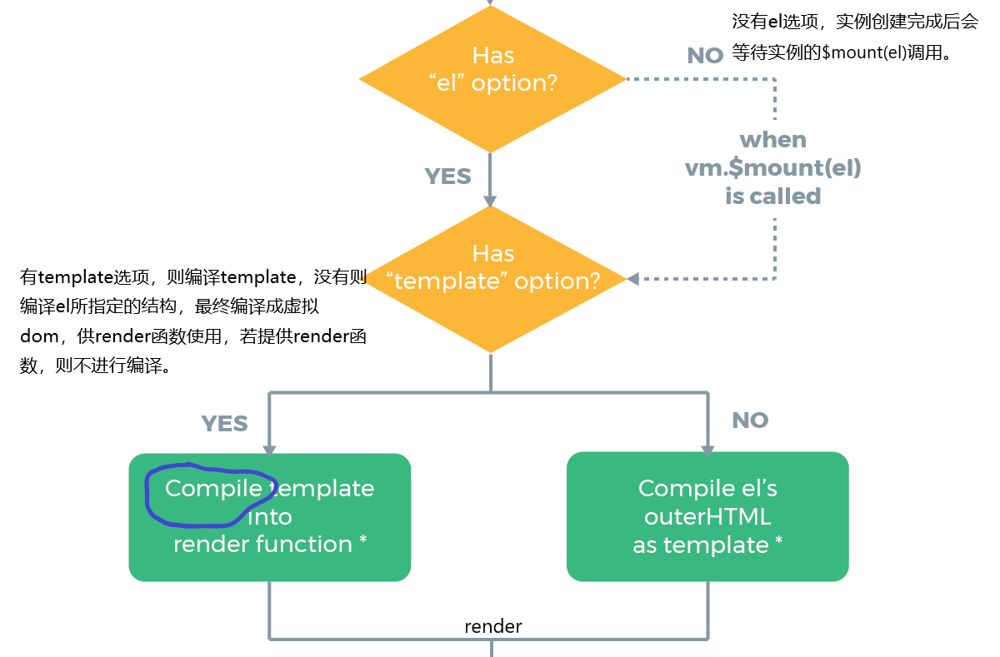

生命周期


## 一、beforeCreate

这个钩子函数之前，进行vue实例的初始化，初始化Vue环境事件，和实例的钩子函数。将传入的构造函数的参数，赋值给this.$options 。不能访问data，computed里的数据、methods里的方法等。然后调用beforeCreate函数。


## 二、created

这个钩子函数之前，完成了实例的创建。可以访问实例上data，computed的数据，methods的方法。然后调用created函数

- 数据注入
- 数据劫持


## 三、beforeMount

实例创建完成，开始构建页面容器。




## 

这个钩子函数之前，将页面模板编译虚拟dom供render函数使用。并将this.$el赋值为options里所提供的页面元素。然后调用beforeMount函数


## 四、mounted

这个钩子函数之前，执行render函数，创建真实的dom并将替换到this.$el。然后调用mounted方法。至此，已经全部完成vue实例的创建，和dom的挂载。


## 五、beforeUpdate

在这个钩子函数之前，数据已经变化，页面还没重新渲染。然后调用beforeUpdate函数。


## 六、updated

在这个钩子函数之前，根据最新的数据，生成新的虚拟dom，通过diff算法比对新老虚拟dom，对不同之处打上补丁，然后re-render，页面更新。然后调用updated函数。


```js
  methods: {
    say(){
      console.log(this.$refs.msg);
      this.msg = 123
      console.log(this.$refs.msg);
      this.$nextTick(()=>console.log(this.$refs.msg))
    }
  },
  //async await
    async say(){
      console.log(this.$refs.msg);
      this.msg = 123
      await this.$nextTick()
      console.log(this.$refs.msg)
    }
```


在页面更新之后立即调用，$nextTick里的callBack。


## 七、beforeDestroy

开始销毁实例，调用vm.destory方法，


## 八、destroyed

不再具有响应式